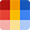

# 
   Color-Card 

### 
 A Handy Tool for Accessing Material Design Colors 

**Color-Card** is a Chrome extension that provides quick access to the Material Design color palette. Click any color swatch to instantly copy its value to your clipboard in either HEX or RGB format.

## Features

*   **Full Material Design Palette**: Displays the standard Material Design colors, including primary shades (50-900) and accent shades (A100-A700), plus White and Black.
*   **Click-to-Copy**: Simply click on any color swatch to copy its value.
*   **HEX/RGB Toggle**: Easily switch between copying and viewing color values in HEX (#RRGGBB) or RGB (R,G,B) format using the toggle switch.
*   **Interactive UI**: Swatches provide visual feedback on hover and click. A toast notification confirms successful copying.
*   **Opens in New Tab**: The color palette interface opens in a dedicated browser tab for ample space and easy access.
*   **Multilingual Support**: Currently supports *English (en)*, *Simplified Chinese (zh_CN)*, *Japanese (ja)*, *Korean (ko)*, *French (fr)*, *German (de)*, *Italian (it)*, *Spanish (es)*, *Portuguese (pt)*, *Dutch (nl)*, *Swedish (sv)*.

## Installation

### Manual Installation
1.  Download the source code (e.g., as a ZIP file) and unzip it to a local directory.
2.  Open Chrome and navigate to `chrome://extensions/`.
3.  Enable "Developer mode" using the toggle switch in the top-right corner.
4.  Click "Load unpacked" and select the directory where you unzipped the source code.
5.  The Color-Card extension icon should appear in your browser toolbar. Click it to open the Color-Card tab.

### From Chrome Web Store
*   [https://chromewebstore.google.com/detail/color-card/ggnlibimkfodncglaonodelcplopfcnc](https://chromewebstore.google.com/detail/color-card/ggnlibimkfodncglaonodelcplopfcnc)

## Usage

1.  Click the Color-Card icon in your browser toolbar. This will open the color palette in a new tab.
    *(If you don't see the icon, navigate to `chrome://extensions/`, find Color-Card, click "Details", and enable "Pin to toolbar").*
2.  Just click on a color card to copy its color value to your clipboard. A confirmation message (toast notification) will appear briefly.
3.  Use the toggle switch at the top (below the title) to switch the displayed and copied format between HEX and RGB.

## How It Works

*   The extension's icon click triggers opening the `color_card.html` page in a new tab.
*   JavaScript dynamically generates the color grid based on predefined Material Design color data.
*   Clicking a swatch uses the `navigator.clipboard` API to copy the color value (respecting the HEX/RGB toggle state).
*   The theme preference and HEX/RGB format preference *(Self-correction: Format preference isn't saved in the provided code, only theme)* are managed locally. Theme preference is saved using `localStorage`.
*   The extension uses locally included fonts (Noto Sans, Roboto Mono) via `@font-face`.

## Browser Compatibility

This extension is designed and tested for:
*   Google Chrome (latest versions recommended)
*   **NOTE**: Compatibility with other Chromium-based browsers (Microsoft Edge, Brave, Opera, etc.) is likely but not officially tested.

## License

This project is licensed under the GNU General Public License v3.0.

## Privacy

Color-Card operates entirely on your local device and respects your privacy. See the full [Privacy Policy](PRIVACY.md) for details.
*   No color selection or usage data is collected or transmitted.
*   Only your selected theme preference is stored locally in **your browser** on **your computer**.

## Contributing

Contributions are welcome! If you'd like to improve Color-Card:

1.  Fork the repository *(Link to your repository)*
2.  Create your feature branch (`git checkout -b feature/your-feature`)
3.  Commit your changes (`git commit -m 'Add your feature'`)
4.  Push to the branch (`git push origin feature/your-feature`)
5.  Open a Pull Request

## Support

If you encounter any issues, bugs, or have questions or suggestions, please open an issue on the GitHub repository.